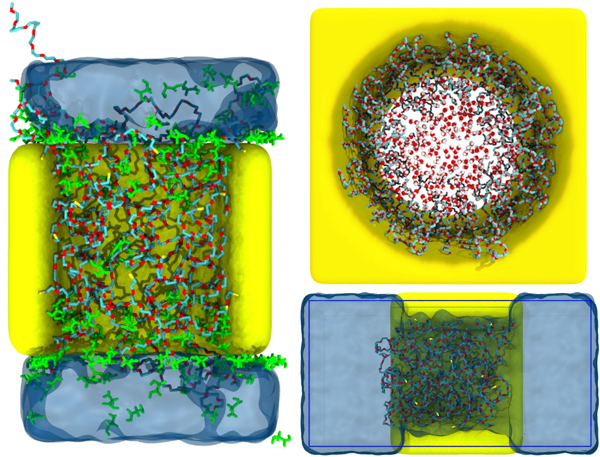

## Nanopore-analysis
Trajectory analysis code for polymer grafted nanopore using bin-wise calculation for
- polymer/water volume fraction
- polymer end group distribution
- water residence correlation time

## How to cite
Chen, Guang and Dormidontova, Elena. "PEO-Grafted Gold Nanopore: Grafting Density, Chain Length, and Curvature Effects." Macromolecules 2022, 55, 12, 5222–5232. 
https://doi.org/10.1021/acs.macromol.2c00323
